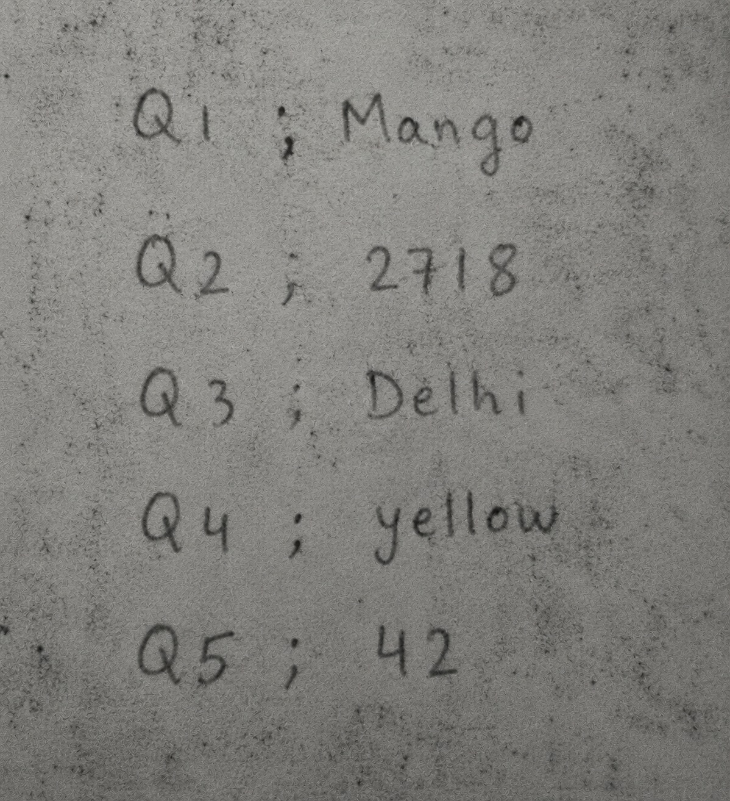
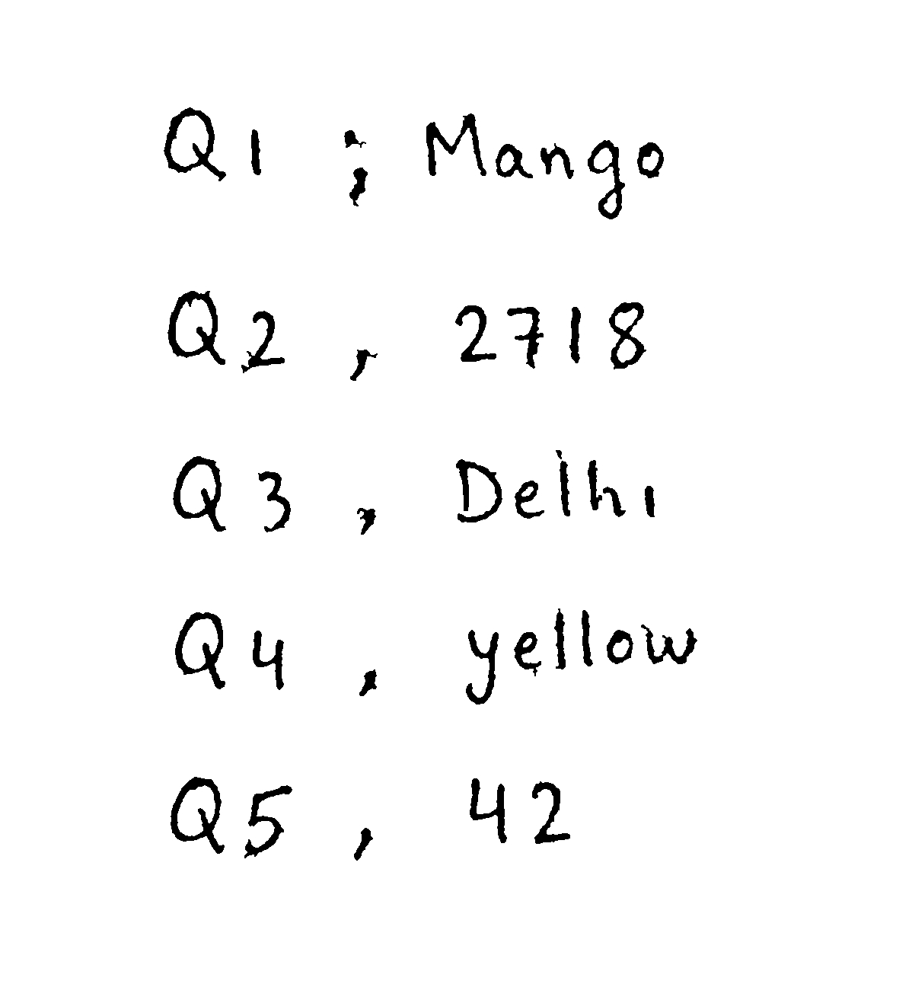
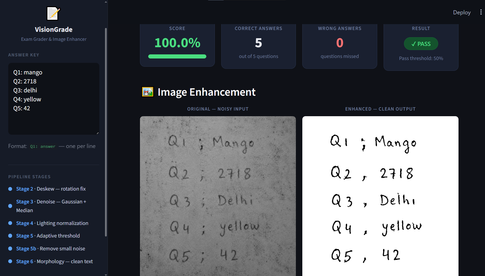

# VisionGrade — Automatic Exam Answer Sheet Grader

AI-powered handwritten exam grading system built using Computer Vision, OCR, and fuzzy text matching.

---

# Overview

VisionGrade is an end-to-end system that automatically processes handwritten answer sheets, extracts answers using OCR, and grades them against a teacher-provided answer key.

The project combines:

- Image enhancement from scratch using NumPy
- OCR-based handwriting recognition
- Intelligent answer parsing
- Fuzzy matching for OCR error tolerance
- Automatic grading and score generation
- Interactive Streamlit web interface

---

# Features

- Handwritten answer sheet grading
- OCR-based text recognition
- Image preprocessing and enhancement pipeline
- Adaptive thresholding and noise removal
- Automatic skew correction (deskewing)
- Fuzzy answer matching for OCR mistakes
- Streamlit web application UI
- Modular architecture for easy extension

---

# System Pipeline

```text
Input Answer Sheet
        ↓
Image Enhancement Pipeline
        ↓
OCR Text Recognition
        ↓
Question & Answer Parsing
        ↓
Fuzzy Matching Against Answer Key
        ↓
Automatic Grade Report
```

---

# Image Enhancement Pipeline

The preprocessing pipeline is implemented almost entirely from scratch using NumPy.

## Stages

1. Grayscale Conversion
2. Deskew / Rotation Correction
3. Median + Gaussian Noise Removal
4. Background Lighting Normalization
5. Adaptive Thresholding
6. Small Component Removal
7. Morphological Cleanup

---

# OCR & Grading

The system uses RapidOCR for handwriting recognition and applies multiple matching strategies to handle OCR imperfections.

## Matching Strategies

- Exact match
- Normalized text match
- OCR confusion matching
- Levenshtein edit distance
- Partial containment matching

This allows the system to correctly handle common OCR mistakes such as:

```text
0 ↔ o
1 ↔ l ↔ i
5 ↔ s
8 ↔ b
```

---

# Technologies Used

- Python
- NumPy
- RapidOCR
- Pillow
- Streamlit
- ONNX Runtime

---

# Project Structure

```text
VisionGrade-AI/
│
├── app.py
├── main.py
├── grader.py
├── ocr_engine.py
├── scratch_image.py
│
├── requirements.txt
├── README.md
├── sample_answer_key.txt
├── .gitignore
│
├── docs/
│   └── Exam_Grader_Report.pdf
│
├── samples/
│   ├── test1.jpeg
│   ├── test2.jpeg
│   ├── test3.png
│   ├── test1_enhanced.jpg
│   └── test2_enhanced.jpg
```

---

# Installation

```bash
pip install -r requirements.txt
```

---

# Run the Application

```bash
streamlit run app.py
```

---

# Sample Answer Key Format

```text
Q1: apple
Q2: 1423
Q3: Cairo
Q4: blue
Q5: 99
```

---

# Example Workflow

1. Upload a handwritten answer sheet.
2. The system enhances and cleans the image.
3. OCR extracts handwritten answers.
4. Answers are parsed and matched.
5. A final grade report is generated automatically.

---

# Screenshots

## Original Input



## Enhanced Output



## Grading Interface

_Add screenshot here_



# Future Improvements

- Better multilingual handwriting support
- Deep-learning-based handwritten OCR
- Exportable PDF grade reports
- Cloud deployment
- Real-time webcam grading
- Student analytics dashboard

---

# Authors

- Mohamed Saber Labib Mostafa
- Team Members

---

# Academic Report

A detailed technical report explaining the architecture, algorithms, preprocessing pipeline, OCR integration, and grading logic is included in:

```text
docs/Exam_Grader_Report.pdf
```

---

# License

This project is intended for educational and research purposes.

